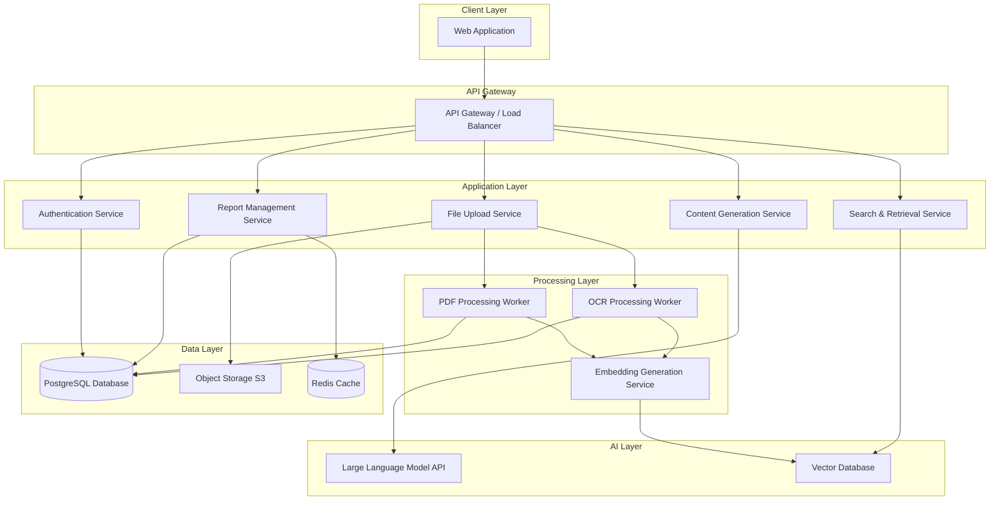

# Design Document: Report Writing Assistant

## Overview

The Report Writing Assistant is a web-based application that helps students and interns write comprehensive final reports by leveraging AI to analyze scattered notes and generate structured content. The system consists of a frontend web interface, a backend API server, document processing services, an AI content generation engine, and secure data storage.

The application workflow:
1. User authenticates and creates a new report project
2. User uploads a report template (PDF) which is analyzed for structure
3. User uploads various note sources (text files, images, notebooks)
4. System processes and indexes all content using semantic search
5. AI maps notes to relevant report sections
6. User requests content generation for specific sections
7. AI generates draft content based on relevant notes
8. User edits and refines the generated content
9. User exports the final report in the required format

## Architecture

The system follows a microservices architecture with the following components:



### Technology Stack

**Frontend:**
- React with TypeScript for the web interface
- TailwindCSS for styling
- React Query for state management and API calls
- React PDF Viewer for template preview

**Backend:**
- Python with FastAPI for REST API services
- JWT for authentication
- Celery for asynchronous task processing
- Redis as message broker and cache

**Document Processing:**
- PyMuPDF (fitz) for PDF text extraction
- pdf2image + Tesseract OCR for scanned PDFs and images
- pdfplumber for advanced layout analysis
- Pillow for image preprocessing

**AI & Search:**
- OpenAI GPT-4 or Anthropic Claude for content generation
- Sentence Transformers for generating embeddings
- Pinecone or Qdrant for vector database
- LangChain for LLM orchestration

**Data Storage:**
- PostgreSQL for structured data (users, reports, metadata)
- AWS S3 or MinIO for file storage
- Redis for session management and caching

**Infrastructure:**
- Docker for containerization
- Kubernetes or AWS ECS for orchestration
- Nginx as reverse proxy
- GitHub Actions for CI/CD

## Components and Interfaces

### 1. Authentication Service

**Responsibilities:**
- User registration and login
- JWT token generation and validation
- Session management
- Password hashing and security

**API Endpoints:**
```
POST /api/auth/register
POST /api/auth/login
POST /api/auth/logout
POST /api/auth/refresh
GET /api/auth/me
```

**Interface:**
```python
class AuthService:
    def register_user(email: str, password: str, name: str) -> User
    def authenticate_user(email: str, password: str) -> TokenPair
    def validate_token(token: str) -> User
    def refresh_token(refresh_token: str) -> TokenPair
    def logout_user(token: str) -> bool
```

### 2. Report Management Service

**Responsibilities:**
- Create and manage report projects
- Track report structure and sections
- Store report metadata and progress
- Manage report versions

**API Endpoints:**
```
POST /api/reports
GET /api/reports
GET /api/reports/{report_id}
PUT /api/reports/{report_id}
DELETE /api/reports/{report_id}
GET /api/reports/{report_id}/sections
PUT /api/reports/{report_id}/sections/{section_id}
```

**Interface:**
```python
class ReportService:
    def create_report(user_id: str, title: str) -> Report
    def get_user_reports(user_id: str) -> List[Report]
    def get_report(report_id: str) -> Report
    def update_report(report_id: str, updates: dict) -> Report
    def delete_report(report_id: str) -> bool
    def get_report_sections(report_id: str) -> List[ReportSection]
    def update_section_content(report_id: str, section_id: str, content: str) -> ReportSection
    def calculate_progress(report_id: str) -> ProgressMetrics
```

### 3. File Upload Service

**Responsibilities:**
- Handle file uploads (template and notes)
- Validate file types and sizes
- Store files in object storage
- Queue processing jobs

**API Endpoints:**
```
POST /api/uploads/template
POST /api/uploads/notes
GET /api/uploads/{upload_id}/status
DELETE /api/uploads/{upload_id}
```

**Interface:**
```python
class UploadService:
    def upload_template(report_id: str, file: UploadFile) -> UploadJob
    def upload_note(report_id: str, file: UploadFile, metadata: dict) -> UploadJob
    def get_upload_status(upload_id: str) -> UploadStatus
    def delete_upload(upload_id: str) -> bool
    def validate_file(file: UploadFile) -> ValidationResult
```

### 4. PDF Processing Worker

**Responsibilities:**
- Extract text from PDF templates
- Identify document structure (sections, headings)
- Extract formatting information
- Generate document outline

**Interface:**
```python
class PDFProcessor:
    def process_template(file_path: str, report_id: str) -> TemplateStructure
    def extract_text(file_path: str) -> str
    def identify_sections(text: str, layout_info: dict) -> List[Section]
    def extract_formatting(file_path: str) -> FormattingRules
    def generate_outline(sections: List[Section]) -> DocumentOutline
```

### 5. OCR Processing Worker

**Responsibilities:**
- Convert images and scanned PDFs to text
- Preprocess images for better OCR accuracy
- Extract text using Tesseract
- Handle multiple image formats

**Interface:**
```python
class OCRProcessor:
    def process_image(file_path: str, note_id: str) -> ProcessedNote
    def preprocess_image(image: Image) -> Image
    def extract_text_from_image(image: Image) -> str
    def process_scanned_pdf(file_path: str) -> str
    def detect_language(image: Image) -> str
```

### 6. Embedding Generation Service

**Responsibilities:**
- Generate vector embeddings for text content
- Store embeddings in vector database
- Batch processing for efficiency
- Handle embedding model updates

**Interface:**
```python
class EmbeddingService:
    def generate_embedding(text: str) -> List[float]
    def generate_batch_embeddings(texts: List[str]) -> List[List[float]]
    def store_embedding(note_id: str, embedding: List[float], metadata: dict) -> bool
    def update_embeddings(note_ids: List[str]) -> bool
```

### 7. Search & Retrieval Service

**Responsibilities:**
- Semantic search across notes
- Map notes to report sections
- Rank results by relevance
- Filter by metadata (date, file type)

**API Endpoints:**
```
POST /api/search
POST /api/search/map-to-sections
GET /api/search/section/{section_id}/notes
```

**Interface:**
```python
class SearchService:
    def semantic_search(query: str, report_id: str, filters: dict) -> List[SearchResult]
    def map_notes_to_sections(report_id: str) -> SectionNoteMapping
    def get_relevant_notes(section_id: str, limit: int) -> List[Note]
    def rerank_results(results: List[SearchResult], criteria: dict) -> List[SearchResult]
```

### 8. Content Generation Service

**Responsibilities:**
- Generate draft content using LLM
- Synthesize information from multiple notes
- Maintain academic tone and style
- Provide source citations

**API Endpoints:**
```
POST /api/content/generate
POST /api/content/regenerate
POST /api/content/improve
POST /api/content/expand
```

**Interface:**
```python
class ContentService:
    def generate_section_content(section_id: str, notes: List[Note], style: str) -> GeneratedContent
    def regenerate_content(section_id: str, feedback: str) -> GeneratedContent
    def improve_text(text: str, improvement_type: str) -> str
    def expand_text(text: str, target_length: int) -> str
    def synthesize_notes(notes: List[Note]) -> str
    def add_citations(content: str, sources: List[Note]) -> str
```

### 9. Export Service

**Responsibilities:**
- Generate final report documents
- Apply template formatting
- Export to multiple formats (PDF, DOCX)
- Include images and figures

**API Endpoints:**
```
POST /api/export/pdf
POST /api/export/docx
GET /api/export/{export_id}/status
GET /api/export/{export_id}/download
```

**Interface:**
```python
class ExportService:
    def export_to_pdf(report_id: str, formatting: FormattingRules) -> ExportJob
    def export_to_docx(report_id: str, formatting: FormattingRules) -> ExportJob
    def apply_template_formatting(content: str, template: TemplateStructure) -> FormattedDocument
    def include_media(document: Document, media_items: List[MediaItem]) -> Document
    def get_export_status(export_id: str) -> ExportStatus
```

## Data Models

### User
```python
class User:
    id: UUID
    email: str
    password_hash: str
    name: str
    created_at: datetime
    last_login: datetime
    is_active: bool
```

### Report
```python
class Report:
    id: UUID
    user_id: UUID
    title: str
    description: str
    template_file_id: UUID
    template_structure: TemplateStructure
    created_at: datetime
    updated_at: datetime
    status: ReportStatus  # draft, in_progress, completed
    progress_percentage: float
    total_word_count: int
```

### TemplateStructure
```python
class TemplateStructure:
    sections: List[Section]
    formatting_rules: FormattingRules
    page_layout: PageLayout
    style_guide: dict
```

### Section
```python
class Section:
    id: str
    title: str
    level: int  # 1 for main sections, 2 for subsections
    order: int
    parent_id: Optional[str]
    description: str
    required: bool
```

### ReportSection
```python
class ReportSection:
    id: UUID
    report_id: UUID
    section_id: str
    content: str
    word_count: int
    is_complete: bool
    last_edited: datetime
    version: int
```

### Note
```python
class Note:
    id: UUID
    report_id: UUID
    file_name: str
    file_type: str  # text, image, pdf
    original_file_path: str
    extracted_text: str
    upload_date: datetime
    metadata: dict  # file size, creation date, etc.
    processing_status: ProcessingStatus
```

### NoteEmbedding
```python
class NoteEmbedding:
    id: UUID
    note_id: UUID
    text_chunk: str
    embedding: List[float]
    chunk_index: int
    metadata: dict
```

### SectionNoteMapping
```python
class SectionNoteMapping:
    section_id: str
    note_id: UUID
    relevance_score: float
    note_excerpts: List[str]
```

### GeneratedContent
```python
class GeneratedContent:
    content: str
    sources: List[UUID]  # note IDs
    citations: List[Citation]
    word_count: int
    generation_timestamp: datetime
```

### Citation
```python
class Citation:
    note_id: UUID
    note_name: str
    excerpt: str
    position_in_content: int
```

### UploadJob
```python
class UploadJob:
    id: UUID
    report_id: UUID
    file_name: str
    file_type: str
    status: JobStatus  # pending, processing, completed, failed
    created_at: datetime
    completed_at: Optional[datetime]
    error_message: Optional[str]
```

### ExportJob
```python
class ExportJob:
    id: UUID
    report_id: UUID
    format: str  # pdf, docx
    status: JobStatus
    file_path: Optional[str]
    created_at: datetime
    completed_at: Optional[datetime]
```

## Correctness Properties

*A property is a characteristic or behavior that should hold true across all valid executions of a system—essentially, a formal statement about what the system should do. Properties serve as the bridge between human-readable specifications and machine-verifiable correctness guarantees.*

### Property 1: Authentication Token Validity

*For any* valid authentication token, validating it should return the same user that was authenticated when the token was created, and the token should remain valid until its expiration time.

**Validates: Requirements 1.1, 1.3**

### Property 2: File Upload Idempotency

*For any* file uploaded to the system, uploading the same file multiple times should result in the same extracted content and processing outcome.

**Validates: Requirements 3.1, 3.2, 3.3**

### Property 3: PDF Structure Extraction Consistency

*For any* valid PDF template, extracting the structure multiple times should produce the same section hierarchy and ordering.

**Validates: Requirements 2.2, 2.3**

### Property 4: OCR Text Extraction Determinism

*For any* image file, processing it through OCR multiple times with the same preprocessing should produce the same extracted text.

**Validates: Requirements 3.2**

### Property 5: Semantic Search Relevance Ordering

*For any* search query and set of notes, the returned results should be ordered by relevance score in descending order, and all results should have a relevance score greater than zero.

**Validates: Requirements 9.1, 9.2**

### Property 6: Section-Note Mapping Completeness

*For any* report with uploaded notes, every note should be mapped to at least one report section, and every section should have at least one note mapped to it if notes exist.

**Validates: Requirements 4.2, 4.3**

### Property 7: Content Generation Source Traceability

*For any* generated content, all facts and information in the content should be traceable to at least one source note through citations.

**Validates: Requirements 5.4, 5.5**

### Property 8: Auto-Save Data Consistency

*For any* user edit to report content, if the system auto-saves within 30 seconds, then loading the report should return the exact content that was saved.

**Validates: Requirements 8.1, 8.2**

### Property 9: Progress Calculation Accuracy

*For any* report, the calculated progress percentage should equal the ratio of completed sections to total sections, multiplied by 100.

**Validates: Requirements 8.3, 8.4**

### Property 10: Export Format Preservation

*For any* report exported to PDF, the section structure and ordering in the exported document should match the template structure exactly.

**Validates: Requirements 7.1, 7.2**

### Property 11: Search Filter Correctness

*For any* search with date range filters, all returned results should have upload dates within the specified range, and no results outside the range should be returned.

**Validates: Requirements 9.3**

### Property 12: Data Encryption at Rest

*For any* file stored in the system, reading the raw storage should return encrypted data, and only authorized decryption should return the original content.

**Validates: Requirements 10.1**

### Property 13: Session Expiration Enforcement

*For any* expired session token, attempting to use it for any authenticated operation should result in an authentication error requiring re-login.

**Validates: Requirements 1.3**

### Property 14: Note Deletion Cascade

*For any* note deleted from a report, all associated embeddings, mappings, and citations should also be removed from the system.

**Validates: Requirements 10.3**

### Property 15: Content Regeneration Consistency

*For any* report section, regenerating content with the same notes and parameters should produce semantically similar content with the same key facts.

**Validates: Requirements 6.3**

## Error Handling

### Error Categories

**1. Authentication Errors (4xx)**
- Invalid credentials → 401 Unauthorized
- Expired token → 401 Unauthorized
- Insufficient permissions → 403 Forbidden

**2. Validation Errors (4xx)**
- Invalid file format → 400 Bad Request with specific format requirements
- File too large → 413 Payload Too Large with size limit
- Missing required fields → 400 Bad Request with field details

**3. Processing Errors (5xx)**
- PDF extraction failure → Retry with OCR fallback, notify user if both fail
- OCR failure → Log error, notify user, allow re-upload
- Embedding generation failure → Retry up to 3 times, then alert admin

**4. External Service Errors (5xx)**
- LLM API timeout → Retry with exponential backoff (3 attempts)
- Vector database unavailable → Use cached results if available, otherwise return 503
- Storage service error → Retry operation, notify user if persistent

**5. Data Errors (4xx/5xx)**
- Report not found → 404 Not Found
- Concurrent edit conflict → 409 Conflict with merge suggestions
- Database constraint violation → 400 Bad Request with explanation

### Error Handling Strategies

**Retry Logic:**
- Transient failures: Exponential backoff (1s, 2s, 4s)
- Maximum 3 retry attempts for external services
- Circuit breaker pattern for repeated failures

**Graceful Degradation:**
- If semantic search fails, fall back to keyword search
- If LLM unavailable, queue requests for later processing
- If export fails, save progress and allow retry

**User Notification:**
- Real-time error messages in UI
- Email notifications for long-running job failures
- Detailed error logs for debugging (admin only)

**Data Integrity:**
- Database transactions for multi-step operations
- Rollback on failure to maintain consistency
- Periodic data validation jobs

## Testing Strategy

### Unit Testing

**Framework:** pytest for Python backend, Jest for React frontend

**Coverage Requirements:** Minimum 80% code coverage

**Focus Areas:**
- Individual service methods
- Data model validation
- Utility functions
- API endpoint handlers

**Example Unit Tests:**
- Test password hashing and verification
- Test JWT token generation and validation
- Test file type validation logic
- Test progress calculation formulas
- Test section ordering algorithms

### Property-Based Testing

**Framework:** Hypothesis for Python

**Configuration:** Minimum 100 iterations per property test

**Test Tagging Format:** `# Feature: report-writing-assistant, Property {number}: {property_text}`

**Property Test Implementation:**

Each correctness property must be implemented as a property-based test:

1. **Property 1: Authentication Token Validity**
   - Generate random user data
   - Create authentication token
   - Validate token returns same user
   - Verify token validity until expiration

2. **Property 2: File Upload Idempotency**
   - Generate random file content
   - Upload file multiple times
   - Verify extracted content is identical

3. **Property 3: PDF Structure Extraction Consistency**
   - Generate or use sample PDF templates
   - Extract structure multiple times
   - Verify section hierarchy matches

4. **Property 4: OCR Text Extraction Determinism**
   - Generate random images with text
   - Process multiple times
   - Verify extracted text is identical

5. **Property 5: Semantic Search Relevance Ordering**
   - Generate random queries and note sets
   - Verify results are ordered by descending relevance
   - Verify all scores > 0

6. **Property 6: Section-Note Mapping Completeness**
   - Generate random reports with notes
   - Verify all notes mapped to sections
   - Verify all sections have notes

7. **Property 7: Content Generation Source Traceability**
   - Generate content from notes
   - Verify all facts have citations
   - Verify citations reference actual notes

8. **Property 8: Auto-Save Data Consistency**
   - Generate random edits
   - Trigger auto-save
   - Verify loaded content matches saved

9. **Property 9: Progress Calculation Accuracy**
   - Generate reports with varying completion
   - Verify progress = (completed/total) * 100

10. **Property 10: Export Format Preservation**
    - Generate reports with various structures
    - Export to PDF
    - Verify structure matches template

11. **Property 11: Search Filter Correctness**
    - Generate notes with random dates
    - Apply date filters
    - Verify all results within range

12. **Property 12: Data Encryption at Rest**
    - Store random files
    - Read raw storage
    - Verify data is encrypted

13. **Property 13: Session Expiration Enforcement**
    - Generate expired tokens
    - Attempt operations
    - Verify authentication errors

14. **Property 14: Note Deletion Cascade**
    - Create notes with associations
    - Delete notes
    - Verify all associations removed

15. **Property 15: Content Regeneration Consistency**
    - Generate content with same inputs
    - Verify semantic similarity
    - Verify key facts preserved

### Integration Testing

**Focus Areas:**
- API endpoint workflows
- Service-to-service communication
- Database operations
- File storage operations
- External API integrations

**Example Integration Tests:**
- Complete user registration and login flow
- Upload template → process → extract structure workflow
- Upload notes → process → generate embeddings → search workflow
- Generate content → edit → save → export workflow

### End-to-End Testing

**Framework:** Playwright or Cypress

**Test Scenarios:**
- New user creates account and first report
- User uploads template and multiple note files
- User generates content for all sections
- User edits and exports final report
- User searches notes and inserts excerpts

### Performance Testing

**Tools:** Locust for load testing

**Metrics:**
- API response time < 200ms for 95th percentile
- File upload processing < 30s for typical files
- Content generation < 10s per section
- Search results < 500ms
- Support 100 concurrent users

### Security Testing

**Focus Areas:**
- Authentication and authorization
- Input validation and sanitization
- SQL injection prevention
- XSS prevention
- File upload security
- Data encryption verification

**Tools:** OWASP ZAP, Bandit for Python security linting
