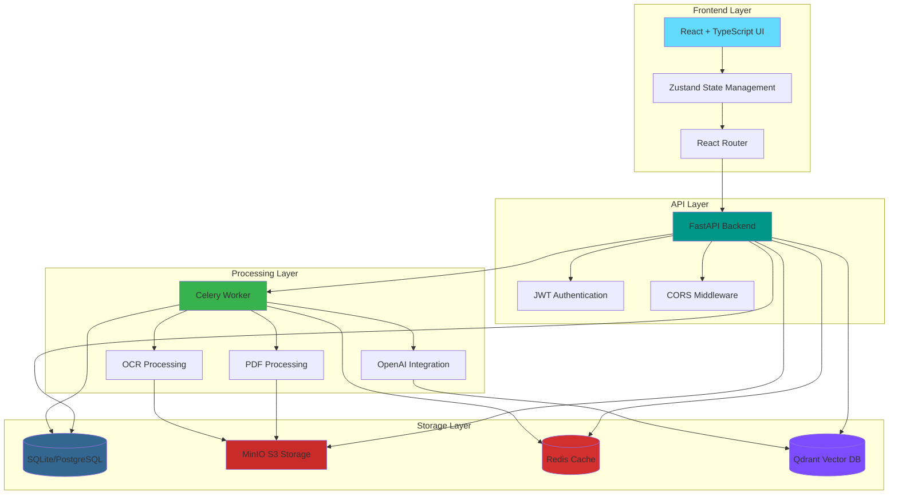
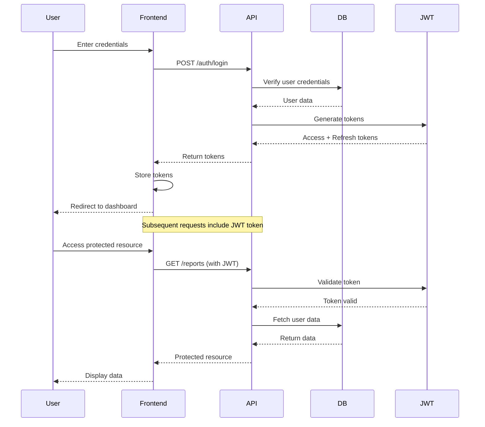
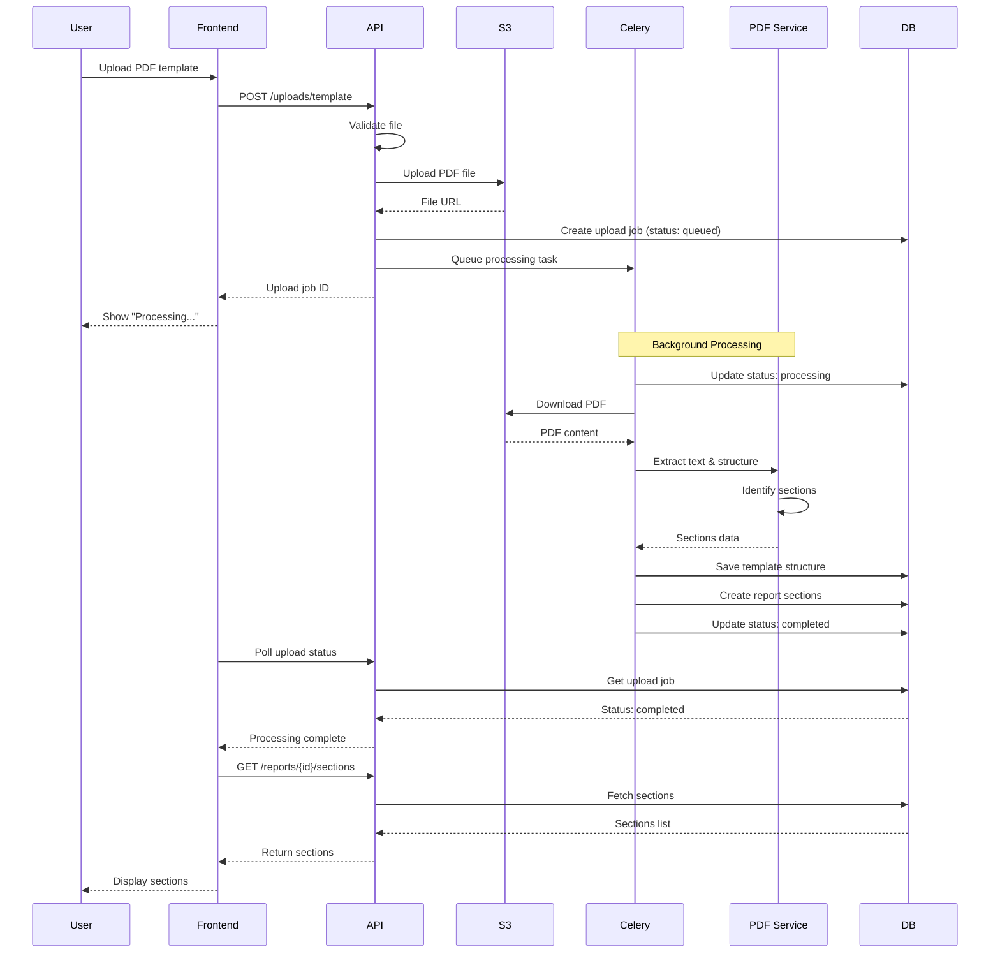
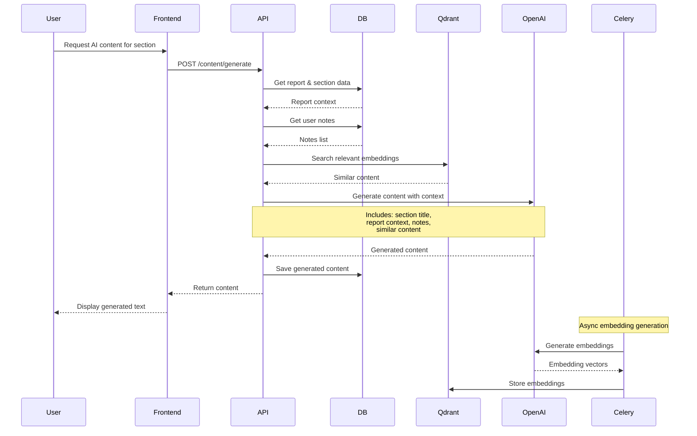
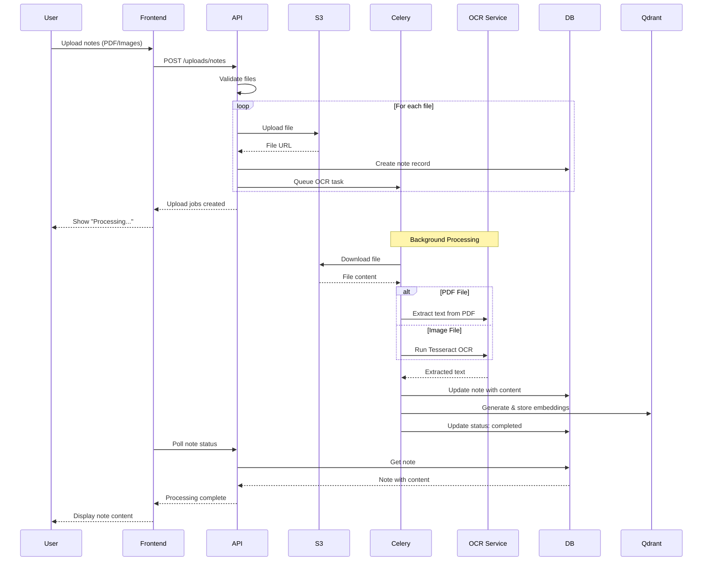
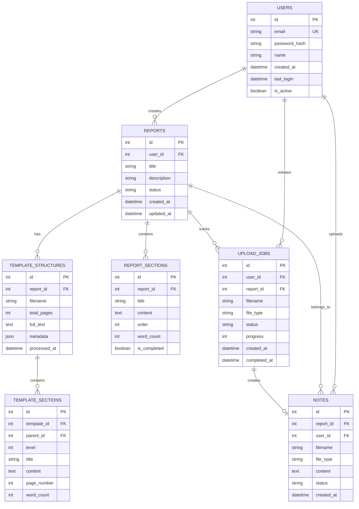
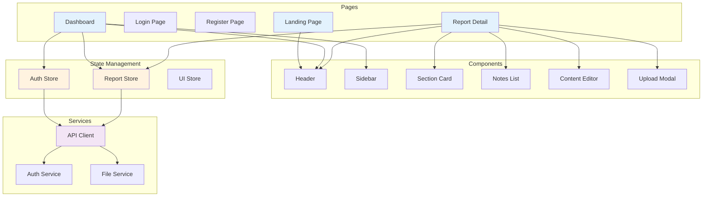
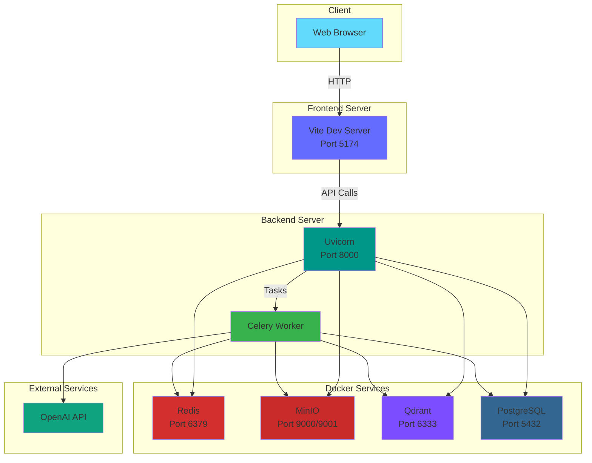
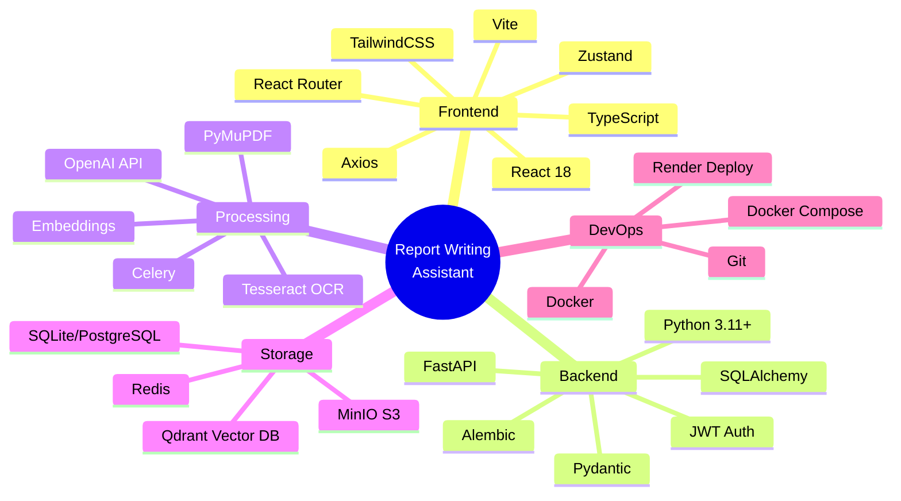
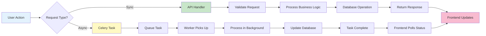

# Report Writing Assistant - Architecture Diagrams

This document contains visual diagrams explaining the system architecture, data flow, and key processes.

## 1. System Architecture Overview

## 2. User Authentication Flow

## 3. Template Upload & Processing Flow

## 4. AI Content Generation Flow

## 5. Notes Upload & OCR Processing

## 6. Database Schema Overview

## 7. Component Architecture (Frontend)

## 8. Deployment Architecture

## 9. Technology Stack

## 10. Request Flow Summary

---

## Key Features Highlighted in Architecture

### 1. **Asynchronous Processing**
- PDF processing happens in background via Celery
- Non-blocking user experience
- Progress tracking for long-running tasks

### 2. **Scalable Storage**
- S3-compatible object storage (MinIO)
- Vector database for semantic search (Qdrant)
- Relational database for structured data
- Redis for caching and message queuing

### 3. **AI Integration**
- OpenAI GPT-4 for content generation
- Embeddings for semantic search
- Context-aware content suggestions

### 4. **Security**
- JWT-based authentication
- CORS protection
- File validation
- User authorization checks

### 5. **Modular Design**
- Separation of concerns
- Service-oriented architecture
- Easy to extend and maintain
- Independent scaling of components

---

## Performance Considerations

1. **Caching Strategy**: Redis caches frequently accessed data
2. **Async Processing**: Heavy tasks don't block API responses
3. **Vector Search**: Fast semantic search using Qdrant
4. **Connection Pooling**: Efficient database connections
5. **File Streaming**: Large files handled efficiently

## Monitoring & Observability

- Celery task monitoring
- API request logging
- Error tracking
- Upload job status tracking
- Processing progress indicators
