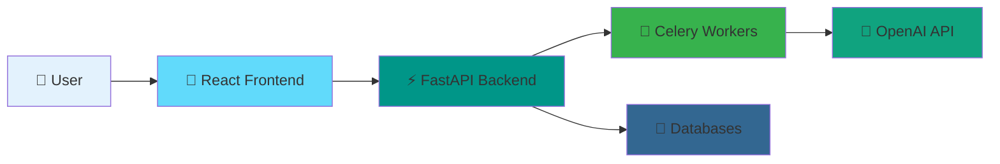
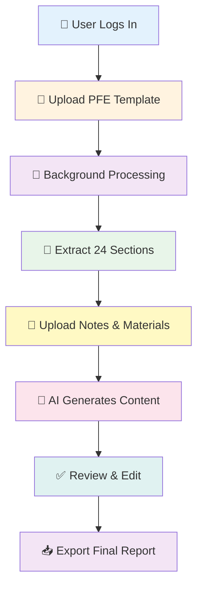
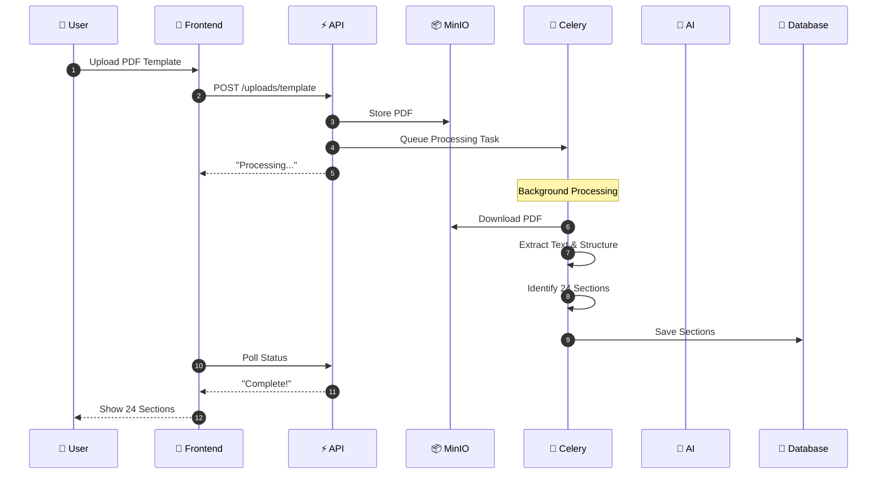
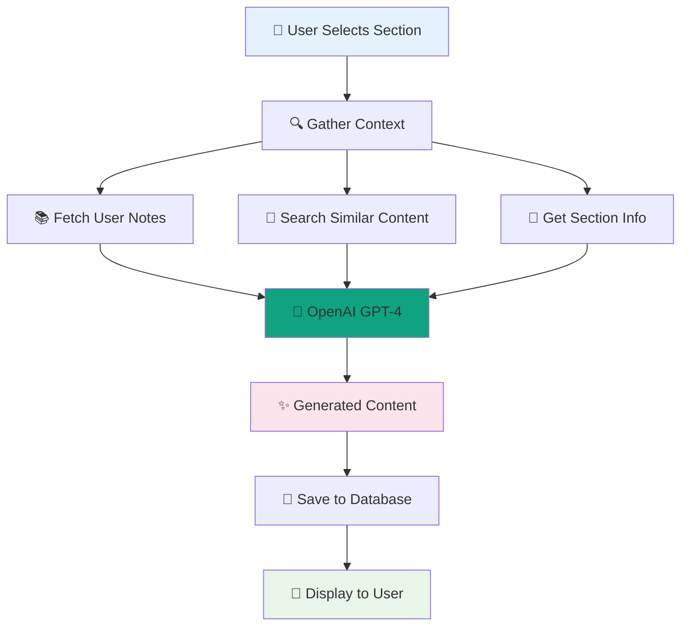
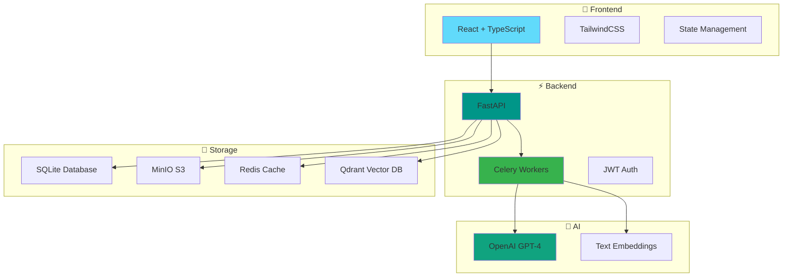
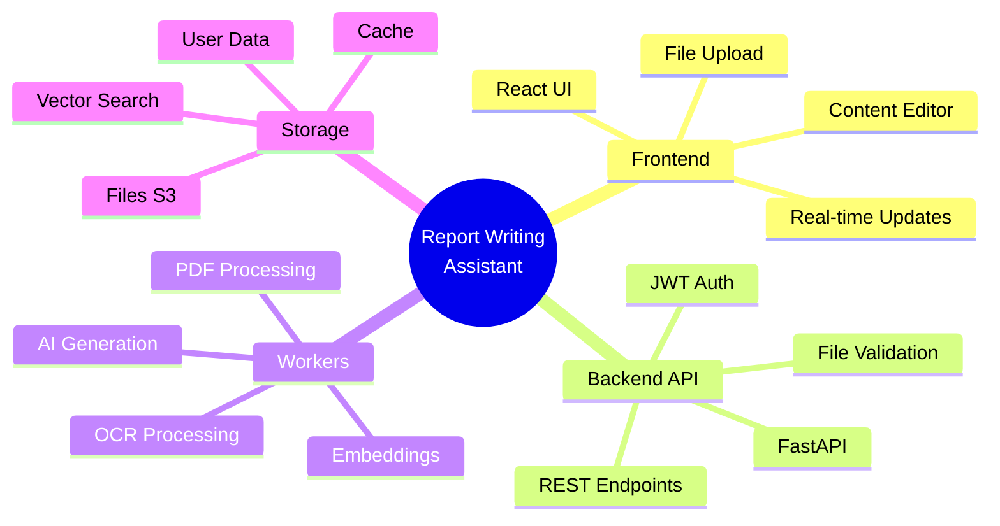

# Report Writing Assistant - Demo Architecture Guide

## Quick Architecture Overview for Demo

### High-Level System Architecture

---

## The Complete User Journey

---

## How Template Processing Works

---

## AI Content Generation Process

---

## Technology Stack (Simple View)

---

## Data Flow: From Upload to Export

```mermaid
flowchart LR
    A[📄 PDF Upload] --> B[☁️ MinIO Storage]
    B --> C[🔄 Celery Processing]
    C --> D[📊 Extract Structure]
    D --> E[💾 Save Sections]
    E --> F[📝 User Adds Notes]
    F --> G[🤖 AI Generation]
    G --> H[✏️ User Edits]
    H --> I[📥 Export PDF/DOCX]
    
    style A fill:#fff3e0
    style C fill:#f3e5f5
    style E fill:#e8f5e9
    style G fill:#fce4ec
    style I fill:#e3f2fd
```

---

## Key Features to Highlight in Demo

### 1. 🚀 Smart Template Processing
- Automatically extracts sections from any PDF template
- Identifies headings, subheadings, and structure
- Creates editable sections in seconds

### 2. 📚 Intelligent Note Management
- Upload PDFs, images, or text files
- OCR for handwritten notes
- Semantic search across all materials

### 3. 🤖 AI-Powered Content Generation
- Context-aware content suggestions
- Uses your notes and materials
- Maintains academic tone and structure

### 4. ⚡ Real-Time Collaboration Ready
- Async processing for smooth UX
- Progress tracking
- No blocking operations

### 5. 🔒 Secure & Private
- JWT authentication
- User-specific data isolation
- Secure file storage

---

## System Components Explained

---

## Demo Flow Suggestion

1. **Show Login** → Secure authentication
2. **Create Report** → Simple form
3. **Upload Template** → Show processing (24 sections extracted!)
4. **Upload Notes** → Multiple files, OCR demo
5. **Generate Content** → AI magic for a section
6. **Edit & Review** → Show editor
7. **Export** → Final PDF/DOCX

---

## Performance Highlights

| Feature | Technology | Benefit |
|---------|-----------|---------|
| Fast Processing | Celery + Redis | Non-blocking uploads |
| Smart Search | Qdrant Vector DB | Find relevant notes instantly |
| Scalable Storage | MinIO S3 | Handle large files |
| AI Integration | OpenAI GPT-4 | High-quality content |
| Real-time Updates | WebSocket Ready | Live progress tracking |

---

## Architecture Benefits

✅ **Scalable**: Each component can scale independently  
✅ **Reliable**: Background processing with retry logic  
✅ **Fast**: Async operations, caching, vector search  
✅ **Secure**: JWT auth, file validation, CORS protection  
✅ **Maintainable**: Clean separation of concerns  
✅ **Extensible**: Easy to add new features  

---

## Future Enhancements

- 🌐 Real-time collaboration (WebSocket)
- 📱 Mobile app
- 🔄 Version control for reports
- 👥 Team workspaces
- 📊 Analytics dashboard
- 🌍 Multi-language support
